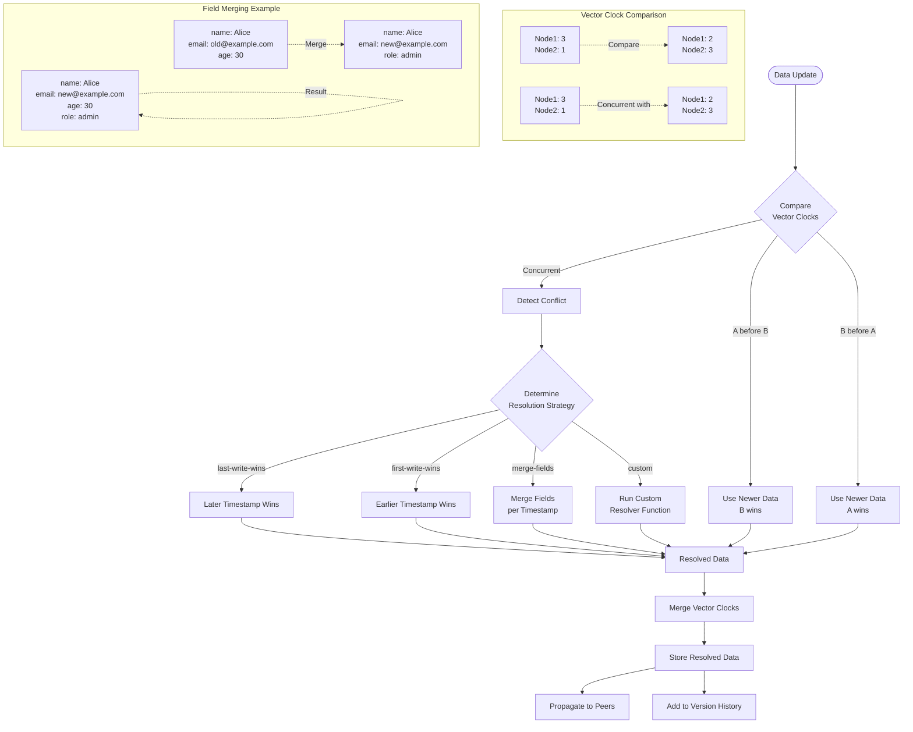

# P2P Data Synchronization Server

A lightweight, distributed peer-to-peer data synchronization server built with Node.js. This system allows multiple nodes to maintain synchronized data across a partially connected network, with automatic data propagation, subscriptions, and querying capabilities.

## Features

- **Peer-to-peer architecture**: No central server required
- **Automatic data synchronization**: Changes propagate throughout the network
- **Subscription system**: Get notified when data changes
- **Multi-hop forwarding**: Updates reach all nodes even in partially connected networks
- **Path-based data model**: Organize data hierarchically using path prefixes
- **Scan operations**: Query data based on path prefixes
- **WebSocket-based communication**: Real-time updates between peers
- **HTTP API**: Simple REST interface for external integrations

## Installation

```bash
# Clone the repository
git clone https://github.com/yourusername/p2p-server.git
cd p2p-server

# Install dependencies
npm install
```

## Quick Start: Hello World with 2 Peers

Create a `hello-world.js` file with the following content:

```javascript
const P2PServer = require("./server");

// Create first server (the "hub")
const server1 = new P2PServer({
  port: 3001,
  dbPath: "./db-server1",
  peers: [], // No peers initially
});

// Create second server (connects to the first)
const server2 = new P2PServer({
  port: 3002,
  dbPath: "./db-server2",
  peers: ["http://localhost:3001"], // Connect to server1
});

// Start both servers
server1.start();
server2.start();

// Wait for connection to establish
setTimeout(async () => {
  try {
    // Server 1 writes data
    console.log("Server 1 storing greeting...");
    await server1.put("greetings/hello", {
      message: "Hello World!",
      timestamp: Date.now(),
    });

    // Wait briefly for data to sync
    setTimeout(async () => {
      // Server 2 reads the data
      console.log("Server 2 retrieving greeting...");
      const greeting = await server2.get("greetings/hello");
      console.log("Server 2 received:", greeting);

      // Server 2 updates the data
      console.log("Server 2 updating greeting...");
      await server2.put("greetings/hello", {
        message: "Hello from Server 2!",
        timestamp: Date.now(),
        origin: "server2",
      });

      // Wait briefly for data to sync back
      setTimeout(async () => {
        // Server 1 reads the updated data
        console.log("Server 1 retrieving updated greeting...");
        const updatedGreeting = await server1.get("greetings/hello");
        console.log("Server 1 received:", updatedGreeting);

        // Set up a subscription on server1
        console.log("Server 1 subscribing to greetings...");
        const unsubscribe = await server1.subscribe(
          "greetings",
          (value, path) => {
            console.log(`Server 1 notification for ${path}:`, value);
          }
        );

        // Server 2 writes new data that should trigger the subscription
        console.log("Server 2 adding new greeting...");
        await server2.put("greetings/welcome", {
          message: "Welcome to P2P Server!",
          timestamp: Date.now(),
        });

        // Wait for notification then clean up
        setTimeout(async () => {
          unsubscribe();
          console.log("Server 1 unsubscribed from greetings");

          // Clean up and exit
          await server1.close();
          await server2.close();
          console.log("Servers closed");
        }, 1000);
      }, 1000);
    }, 1000);
  } catch (error) {
    console.error("Error:", error);
  }
}, 2000);
```

Run it:

```bash
node hello-world.js
```

This example demonstrates:

1. Setting up two P2P server nodes
2. Writing data on one node and reading it from another
3. Updating data and having changes propagate back
4. Setting up subscriptions to receive notifications when data changes
5. Proper cleanup by unsubscribing and closing servers

## Core Components

The system consists of several main components:

### P2PServer

The main server class that coordinates the other components and provides the public API.

### SocketManager

Handles peer connections, manages sockets, and coordinates message passing between peers.

### SyncManager

Manages data synchronization, processes updates, and handles subscriptions.

### DatabaseManager

Handles persistence using LevelDB, including storing, retrieving, and scanning data.

## API Reference

### Constructor

```javascript
const server = new P2PServer({
  port: 3000, // HTTP port to listen on
  dbPath: "./db", // Path for the LevelDB database
  peers: ["http://..."], // URLs of peers to connect to
});
```

### Methods

#### start()

Starts the server, initializes socket connections, and connects to peers.

```javascript
server.start();
```

#### put(path, value)

Stores data at the specified path and synchronizes it with connected peers.

```javascript
await server.put("users/user1", { name: "Alice", age: 30 });
```

**Parameters:**

- `path` (String): The data path (e.g., 'users/user1')
- `value` (Any): The data to store (will be JSON serialized)

**Returns:** Promise that resolves to `{ path, value, timestamp }`

#### get(path)

Retrieves data from the specified path.

```javascript
const user = await server.get("users/user1");
```

**Parameters:**

- `path` (String): The data path to retrieve

**Returns:** Promise that resolves to the stored value, or `null` if not found

#### del(path)

Deletes data at the specified path (implemented as a soft delete by setting value to null).

```javascript
const success = await server.del("users/user1");
```

**Parameters:**

- `path` (String): The data path to delete

**Returns:** Promise that resolves to `true` if successful, `false` otherwise

#### subscribe(path, callback)

Subscribes to changes at a path or prefix. The callback is called whenever data at or below the specified path changes.

```javascript
const unsubscribe = await server.subscribe("users", (value, path) => {
  console.log(`Data at ${path} changed to:`, value);
});

// Later, to unsubscribe:
unsubscribe();
```

**Parameters:**

- `path` (String): The data path prefix to subscribe to
- `callback` (Function): Function called when data changes with parameters:
  - `value`: The new value
  - `path`: The specific path that changed

**Returns:** Promise that resolves to an unsubscribe function

#### scan(prefix, options)

Scans database entries by prefix, returning all entries that start with the given prefix.

```javascript
const users = await server.scan("users/");
```

**Parameters:**

- `prefix` (String): The path prefix to scan for
- `options` (Object): Optional parameters:
  - `limit` (Number): Maximum number of results to return

**Returns:** Promise that resolves to an array of objects, each containing:

- `path`: The full path of the entry
- `value`: The stored value
- `timestamp`: When the entry was last updated
- `origin`: ID of the node that created the entry

#### close()

Gracefully closes the server and database.

```javascript
await server.close();
```

**Returns:** Promise that resolves when the server and database are closed

### Properties

#### server.serverID

A unique hexadecimal ID for this server instance.

#### server.port

The HTTP port this server is listening on.

#### server.dbPath

The filesystem path to the LevelDB database.

#### server.app

The Express application instance, useful for adding custom routes.

## Advanced Usage

### Creating a Network of Nodes

```javascript
// Create a network with three nodes in a chain
const server1 = new P2PServer({ port: 3001, dbPath: "./db1", peers: [] });
const server2 = new P2PServer({
  port: 3002,
  dbPath: "./db2",
  peers: ["http://localhost:3001"],
});
const server3 = new P2PServer({
  port: 3003,
  dbPath: "./db3",
  peers: ["http://localhost:3002"],
});

// Start all servers
server1.start();
server2.start();
server3.start();

// Data written to server1 will eventually reach server3 through server2
```

### RESTful API

The server automatically sets up these HTTP endpoints:

- `GET /api/:path(*)` - Get data at path
- `PUT /api/:path(*)` - Store data at path
- `DELETE /api/:path(*)` - Delete data at path
- `GET /api/scan/:prefix(*)` - Scan data with prefix

Example usage with curl:

```bash
# Store data
curl -X PUT http://localhost:3001/api/users/1 -H "Content-Type: application/json" -d '{"name": "Alice", "age": 30}'

# Get data
curl http://localhost:3001/api/users/1

# Scan data
curl http://localhost:3001/api/scan/users
```

## Architecture

The system uses a distributed architecture where each node can connect to multiple peers, forming a partially connected network. Key aspects include:

1. **Multi-hop Forwarding**: Updates propagate through intermediate nodes
2. **Path-based Data Model**: Data is organized hierarchically
3. **Subscription System**: Receive notifications for data changes
4. **Conflict Resolution**: Last-write-wins based on timestamps
5. **Duplicate Detection**: Message IDs prevent infinite loops

## Technical Details

- Built with Node.js and Express
- Uses Socket.IO for real-time communication
- Uses LevelDB for data persistence
- Implements a decentralized gossip-like protocol for data dissemination

# P2P Server Conflict Resolution Implementation Guide

## Introduction

This guide explains how to implement and use the P2P server with advanced synchronization and conflict resolution capabilities. The system uses vector clocks to track causality between updates and provides several conflict resolution strategies that can be customized per data path.

## Files Overview

The implementation consists of the following new files:

1. `vector-clock.js` - Implements vector clocks for causality tracking
2. `conflict-resolver.js` - Handles conflict detection and resolution
3. `sync-manager.js` - sync manager with conflict resolution
4. `server.js` - Main server class with improved synchronization
5. `example.js` - Example demonstrating the new features

## Getting Started

### 1. Installation

Add the new files to your project's `src` directory. Make sure you have the dependencies from the original `package.json`.

### 2. Basic Usage

To create a P2P server with conflict resolution:

```javascript
const P2PServer = require("./src/server");

const server = new P2PServer({
  port: 3000,
  dbPath: "./my-database",
  peers: ["http://localhost:3001"], // Other peers to connect to

  // Configure conflict resolution
  conflict: {
    defaultStrategy: "merge-fields", // Default strategy for all paths
    pathStrategies: {
      // Set different strategies for specific paths
      users: "merge-fields",
      products: "last-write-wins",
      settings: "first-write-wins",
    },
  },

  // Configure sync behavior
  sync: {
    antiEntropyInterval: 30000, // Run anti-entropy every 30 seconds
    maxVersions: 5, // Keep 5 versions in history
    maxMessageAge: 300000, // Keep processed messages for 5 minutes
  },
});

// Start the server
server.start();
```

### 3. API Methods

The server provides the same API as the original P2P server, with some additions:

```javascript
// Basic operations
await server.put(path, value);
const data = await server.get(path);
await server.del(path);
const results = await server.scan(prefix, options);

// New methods
const history = server.getVersionHistory(path);
server.setConflictStrategy(path, strategy);
server.registerConflictResolver(path, resolverFunction);
await server.runAntiEntropy();
```

## Conflict Resolution Strategies

The system offers several built-in conflict resolution strategies:

### 1. `last-write-wins`

Uses timestamps to determine the winner. The update with the newer timestamp wins.

```javascript
server.setConflictStrategy("products", "last-write-wins");
```

### 2. `first-write-wins`

Opposite of last-write-wins. The update with the older timestamp wins. Useful for configuration data that should be stable once set.

```javascript
server.setConflictStrategy("settings", "first-write-wins");
```

### 3. `merge-fields`

For object values, merges fields from both updates. For fields present in both objects, it uses the one with the newer timestamp.

```javascript
server.setConflictStrategy("users", "merge-fields");
```

### 4. `custom`

Use a custom resolver function for the most complex cases.

```javascript
// Custom resolver that takes the minimum stock level
const safeStockResolver = (path, localData, remoteData) => {
  if (!("stock" in localData.value) || !("stock" in remoteData.value)) {
    return localData.timestamp >= remoteData.timestamp ? localData : remoteData;
  }

  // Take the lowest stock value to be safe
  const safeStock = Math.min(localData.value.stock, remoteData.value.stock);

  // Use the newer timestamp for the result
  const result =
    localData.timestamp >= remoteData.timestamp
      ? { ...localData }
      : { ...remoteData };

  // Override the stock value with our safe minimum
  result.value = { ...result.value, stock: safeStock };

  return result;
};

server.registerConflictResolver("inventory", safeStockResolver);
server.setConflictStrategy("inventory", "custom");
```

## Vector Clocks

Vector clocks track the causal history of updates and help detect concurrent modifications. Each update includes a vector clock that counts the operations from each known node.

When two vector clocks are compared:

- If A < B: A happened before B
- If A > B: A happened after B
- If A || B: A and B are concurrent (conflict)

## Understanding Conflicts

Conflicts occur when two nodes make changes to the same data without knowledge of each other's updates. The system detects these conflicts by comparing vector clocks.

When a conflict is detected, the system:

1. Determines which conflict resolution strategy applies to the data path
2. Applies the strategy to merge the conflicting versions
3. Updates the vector clock to reflect both changes
4. Propagates the resolved data to other nodes

## Anti-Entropy Synchronization

The system periodically runs "anti-entropy" synchronization to ensure consistency, even when normal message propagation fails. This process:

1. Selects a random peer
2. Sends recent changes to ensure the peer has the latest data
3. Runs automatically based on the configured interval

## Version History

The system maintains a history of previous versions for each data path, which enables:

- Auditing changes
- Better conflict resolution with historical context
- Potential rollback capability

Access version history with:

```javascript
const history = server.getVersionHistory("users/user123");
```

## REST API Endpoints

The server includes additional REST API endpoints:

- `GET /api/history/:path` - Get version history for a path
- `GET /api/status` - Get server status including vector clock info

## Best Practices

1. **Choose appropriate conflict strategies** for different types of data:

   - Use `merge-fields` for user profiles and other composite objects
   - Use `last-write-wins` for chat messages and timestamped content
   - Use `first-write-wins` for configuration settings that should be stable
   - Use custom resolvers for complex business logic

2. **Anti-entropy interval**: Set based on your network characteristics:

   - For reliable networks: 1-5 minutes
   - For unreliable networks: 30-60 seconds

3. **Version history**: Adjust `maxVersions` based on your needs:

   - Higher values provide more history but consume more memory
   - 5-10 versions is a good default

4. **Path organization**: Organize data paths to align with conflict resolution needs:
   - Group related data under common prefixes to apply the same strategy

## Advanced Configuration

### Custom Conflict Resolution

For complex business logic, implement custom resolver functions:

```javascript
const customResolver = (path, localData, remoteData) => {
  // localData and remoteData contain:
  // - value: The data value
  // - timestamp: Update timestamp
  // - vectorClock: Vector clock (as object)
  // - origin: Node ID that created the update
  // Your custom logic here
  // Return the resolved data object
};

server.registerConflictResolver("specific/path", customResolver);
server.setConflictStrategy("specific/path", "custom");
```

### Configuring Multiple Paths at Once

Set up multiple path strategies when creating the server:

```javascript
const server = new P2PServer({
  // ... other options
  conflict: {
    defaultStrategy: "last-write-wins",
    pathStrategies: {
      users: "merge-fields",
      products: "last-write-wins",
      settings: "first-write-wins",
      inventory: "custom",
    },
  },
});

// Register any custom resolvers
server.registerConflictResolver("inventory", inventoryResolver);
```

### Flowchart



## Conclusion

The P2P server provides robust synchronization and conflict resolution capabilities for distributed applications. By leveraging vector clocks and customizable conflict strategies, it ensures data consistency across partially connected networks while handling concurrent modifications gracefully.

## License

MIT
